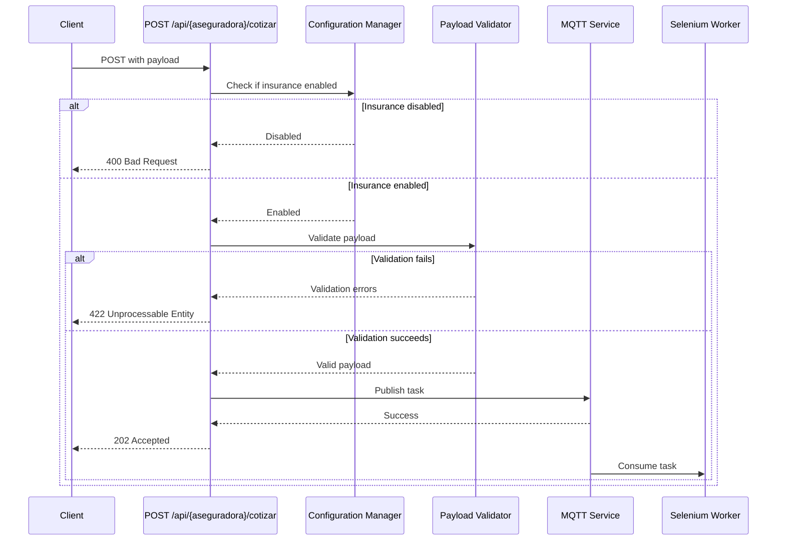
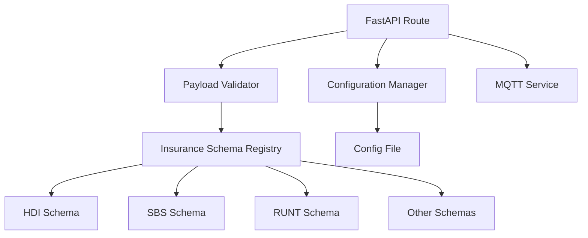

# Design Document: Insurance Payload Validation

## Overview

This design implements a payload validation system for the FastAPI automation server that validates insurance-specific payloads before queueing tasks to MQTT. The system uses Pydantic models for schema validation, a centralized configuration manager for insurance company settings, and maintains full backward compatibility with existing integrations.

The validation layer sits between the API endpoint and the MQTT publishing logic, intercepting requests to validate payloads against insurance-specific schemas. Invalid payloads are rejected with detailed error messages, while valid payloads proceed to MQTT queueing unchanged.

## Architecture

### High-Level Flow



### Component Architecture



## Components and Interfaces

### 1. Insurance Schema Models

**Location:** `app/models/insurance_schemas.py`

Each insurance company has a dedicated Pydantic model defining its required and optional fields. All schemas inherit from a base model that handles common fields.

**Base Schema:**
```python
class InsurancePayloadBase(BaseModel):
    """Base model for all insurance payloads."""
    model_config = ConfigDict(extra="allow")  # Allow extra fields
```

**Example Schema (HDI):**
```python
class HDIPayload(InsurancePayloadBase):
    """Payload schema for HDI insurance."""
    # Asesor fields
    in_strTipoIdentificacionAsesorUsuario: str
    in_strUsuarioAsesor: str
    in_strContrasenaAsesor: str
    
    # Solicitante fields
    in_strTipoDoc: str
    in_strNumDoc: str
    in_strNombre: str
    in_strApellido: str
    in_strGenero: str
    in_strDiaNacimiento: str
    in_strMesNacimiento: str
    in_strAnioNacimiento: str
    
    # Vehiculo fields
    in_strPlaca: str
    in_strUsoVehiculo: str
    in_strModelo: str
    in_strCodFasecolda: str
    in_strMarca: str
    in_strVersion: str
    in_strTipo: str
    in_strCiudadMovilidad: str
    in_strTipoPlaca: str
    in_strKmVehiculo: str
    in_strValorFactura: str
```

**Schema Registry:**
```python
INSURANCE_SCHEMAS: Dict[Aseguradora, Type[InsurancePayloadBase]] = {
    Aseguradora.HDI: HDIPayload,
    Aseguradora.SBS: SBSPayload,
    Aseguradora.RUNT: RUNTPayload,
    Aseguradora.SURA: SURAPayload,
    Aseguradora.AXA: AXAPayload,
    Aseguradora.ALLIANZ: ALLIANZPayload,
    Aseguradora.BOLIVAR: BOLIVARPayload,
    Aseguradora.EQUIDAD: EQUIDADPayload,
    Aseguradora.MUNDIAL: MUNDIALPayload,
    Aseguradora.SOLIDARIA: SOLIDARIAPayload,
}
```

### 2. Configuration Manager

**Location:** `app/services/insurance_config.py`

Manages insurance company configuration including enabled/disabled status.

**Configuration Structure:**
```python
class InsuranceConfig(BaseModel):
    """Configuration for a single insurance company."""
    enabled: bool = True
    description: Optional[str] = None

class InsuranceConfigManager:
    """Manages insurance company configurations."""
    
    def __init__(self, config_path: str = "config/insurance_config.json"):
        self.config_path = config_path
        self._config: Dict[str, InsuranceConfig] = {}
        self.load_config()
    
    def load_config(self) -> None:
        """Load configuration from file."""
        pass
    
    def is_enabled(self, aseguradora: Aseguradora) -> bool:
        """Check if an insurance company is enabled."""
        pass
    
    def get_config(self, aseguradora: Aseguradora) -> InsuranceConfig:
        """Get configuration for an insurance company."""
        pass
    
    def reload(self) -> None:
        """Reload configuration from file."""
        pass
```

**Configuration File Format (JSON):**
```json
{
  "hdi": {
    "enabled": true,
    "description": "HDI Seguros"
  },
  "sura": {
    "enabled": true,
    "description": "SURA Seguros"
  },
  "runt": {
    "enabled": false,
    "description": "RUNT - Temporarily disabled"
  }
}
```

### 3. Payload Validator

**Location:** `app/services/payload_validator.py`

Validates payloads against insurance-specific schemas.

**Interface:**
```python
class PayloadValidator:
    """Validates insurance payloads against schemas."""
    
    def __init__(self):
        self.schemas = INSURANCE_SCHEMAS
    
    def validate(
        self, 
        aseguradora: Aseguradora, 
        payload: Dict[str, Any]
    ) -> Dict[str, Any]:
        """
        Validate payload against insurance schema.
        
        Args:
            aseguradora: Insurance company enum
            payload: Raw payload dictionary
            
        Returns:
            Validated payload dictionary
            
        Raises:
            ValidationError: If validation fails
        """
        pass
    
    def get_schema(self, aseguradora: Aseguradora) -> Type[InsurancePayloadBase]:
        """Get schema for an insurance company."""
        pass
```

### 4. Updated Route Handler

**Location:** `app/routes/cotizaciones.py`

The route handler is updated to integrate validation and configuration checks.

**Updated Flow:**
```python
@router.post("/{aseguradora}/cotizar", ...)
async def crear_cotizacion(
    aseguradora: str,
    data: JobCreate,
    token: str = Depends(verify_token),
    mqtt: MQTTService = Depends(get_mqtt_service),
    config_manager: InsuranceConfigManager = Depends(get_insurance_config),
    validator: PayloadValidator = Depends(get_payload_validator)
) -> APIResponse[JobResponse]:
    # 1. Validate aseguradora enum
    aseg_enum = Aseguradora(aseguradora_lower)
    
    # 2. Check if insurance is enabled
    if not config_manager.is_enabled(aseg_enum):
        raise HTTPException(status_code=400, detail="Insurance not available")
    
    # 3. Validate payload
    validated_payload = validator.validate(aseg_enum, data.payload)
    
    # 4. Create job with validated payload
    job = Job(
        aseguradora=aseg_enum,
        in_strIDSolicitudAseguradora=data.in_strIDSolicitudAseguradora,
        payload=validated_payload
    )
    
    # 5. Publish to MQTT (unchanged)
    # ... existing MQTT logic
```

## Data Models

### JobCreate Model (Updated)

The existing `JobCreate` model remains unchanged to maintain backward compatibility:

```python
class JobCreate(BaseModel):
    in_strIDSolicitudAseguradora: str
    payload: Dict[str, Any] = Field(default_factory=dict)
    
    def __init__(self, **data):
        # Extract in_strIDSolicitudAseguradora and group rest in payload
        # (existing logic unchanged)
```

### Validation Error Response

```python
class ValidationErrorDetail(BaseModel):
    """Detail of a single validation error."""
    field: str
    message: str
    type: str

class ValidationErrorResponse(BaseModel):
    """Response for validation errors."""
    success: bool = False
    error: str = "Validation failed"
    details: List[ValidationErrorDetail]
```

## Error Handling

### Error Types and HTTP Status Codes

1. **Insurance Not Supported (400 Bad Request)**
   - When aseguradora is not in the Aseguradora enum
   - Response includes list of valid insurance companies

2. **Insurance Disabled (400 Bad Request)**
   - When insurance company is disabled in configuration
   - Response indicates insurance is not currently available

3. **Validation Failed (422 Unprocessable Entity)**
   - When payload fails schema validation
   - Response includes detailed list of validation errors
   - Uses Pydantic's ValidationError formatting

4. **MQTT Error (503 Service Unavailable)**
   - When MQTT publishing fails (unchanged from current implementation)

### Error Response Examples

**Insurance Disabled:**
```json
{
  "detail": {
    "error": "Insurance company 'RUNT' is not currently available",
    "aseguradora": "runt",
    "status": "disabled"
  }
}
```

**Validation Failed:**
```json
{
  "detail": [
    {
      "type": "missing",
      "loc": ["body", "payload", "in_strTipoDoc"],
      "msg": "Field required",
      "input": {...}
    },
    {
      "type": "missing",
      "loc": ["body", "payload", "in_strNumDoc"],
      "msg": "Field required",
      "input": {...}
    }
  ]
}
```

## Testing Strategy

### Unit Testing

Unit tests will verify specific validation scenarios and edge cases:

1. **Schema Validation Tests**
   - Test each insurance schema with valid payloads
   - Test missing required fields
   - Test invalid field types
   - Test extra fields are preserved

2. **Configuration Manager Tests**
   - Test loading configuration from file
   - Test checking enabled/disabled status
   - Test default configuration when file missing
   - Test configuration reload

3. **Integration Tests**
   - Test complete request flow with valid payloads
   - Test rejection of invalid payloads
   - Test rejection when insurance disabled
   - Test backward compatibility with existing payloads

### Property-Based Testing

Property-based tests will verify universal correctness properties across all insurance schemas and inputs. Each test will run a minimum of 100 iterations with randomized inputs.


## Correctness Properties

*A property is a characteristic or behavior that should hold true across all valid executions of a system—essentially, a formal statement about what the system should do. Properties serve as the bridge between human-readable specifications and machine-verifiable correctness guarantees.*

### Property 1: Validation Before MQTT Queueing

*For any* insurance company and any payload, validation must complete before the payload is published to MQTT. Invalid payloads should never reach the MQTT queue.

**Validates: Requirements 1.1**

### Property 2: Valid Payload Acceptance

*For any* insurance company and any payload containing all required fields with correct types, the validation system should accept the payload and allow it to proceed to MQTT queueing.

**Validates: Requirements 1.2**

### Property 3: Invalid Payload Rejection

*For any* insurance company and any payload that is missing required fields or contains fields with invalid types, the validation system should reject the request with HTTP 422 and return detailed error information.

**Validates: Requirements 1.3, 1.4**

### Property 4: Extra Fields Preservation

*For any* valid payload containing additional fields not defined in the schema, those extra fields should be preserved and included in the MQTT message unchanged.

**Validates: Requirements 1.5**

### Property 5: Configuration Enforcement

*For any* insurance company, if it is disabled in configuration, requests should be rejected with HTTP 400; if it is enabled with a valid payload, requests should be processed normally.

**Validates: Requirements 3.2, 3.3**

### Property 6: Solicitud ID Required

*For any* request to the API endpoint, the field in_strIDSolicitudAseguradora must be present and non-empty, maintaining backward compatibility.

**Validates: Requirements 4.1**

### Property 7: Flat JSON Compatibility

*For any* flat JSON payload where all fields are at the root level (not nested under "payload"), the JobCreate model should correctly parse it by extracting in_strIDSolicitudAseguradora and grouping remaining fields into the payload dictionary.

**Validates: Requirements 4.2**

### Property 8: Output Format Preservation

*For any* valid request, the Job object structure, MQTT message format, and JobResponse structure should match the pre-validation implementation exactly, ensuring backward compatibility.

**Validates: Requirements 4.3, 4.4, 4.5**

### Property 9: Comprehensive Error Reporting

*For any* invalid payload with one or more validation errors, the error response should contain all validation errors in a single response, with each error including the field name and descriptive message.

**Validates: Requirements 5.1, 5.2, 5.3, 5.4**

### Property 10: Schema Discovery

*For any* insurance company in the Aseguradora enum that has a registered schema, the validation system should automatically retrieve and use the correct schema without requiring routing logic changes.

**Validates: Requirements 6.3**

### Property 11: Schema Registry Completeness

*For all* insurance companies defined in the Aseguradora enum, there should exist a corresponding validation schema in the INSURANCE_SCHEMAS registry.

**Validates: Requirements 2.1**

### Testing Strategy

The validation system will use a dual testing approach combining unit tests and property-based tests:

**Unit Tests** will verify:
- Specific example payloads from docs/integracion-bots-y-apis.md validate correctly for each insurance
- Configuration loading from JSON file
- Configuration reload functionality
- Startup initialization behavior
- Specific error messages for common validation failures

**Property-Based Tests** will verify:
- Universal properties using the `hypothesis` library for Python
- Each property test will run a minimum of 100 iterations
- Tests will generate random payloads with varying combinations of valid/invalid/missing fields
- Each test will be tagged with: **Feature: insurance-payload-validation, Property {number}: {property_text}**

**Property Test Configuration:**
```python
from hypothesis import given, settings
import hypothesis.strategies as st

@settings(max_examples=100)
@given(...)
def test_property_N_description():
    """
    Feature: insurance-payload-validation, Property N: {property text}
    """
    # Test implementation
```

**Test Coverage:**
- Property 1: Test that validation exceptions prevent MQTT publishing
- Property 2: Generate valid payloads and verify acceptance
- Property 3: Generate invalid payloads (missing fields, wrong types) and verify rejection
- Property 4: Generate valid payloads with extra fields and verify preservation
- Property 5: Test with random enabled/disabled configurations
- Property 6: Generate requests with/without in_strIDSolicitudAseguradora
- Property 7: Generate flat JSON payloads and verify correct parsing
- Property 8: Verify Job, MQTT message, and response structure consistency
- Property 9: Generate payloads with multiple errors and verify all are reported
- Property 10: Test schema lookup for all insurance companies
- Property 11: Verify schema registry contains all enum values

The combination of unit tests for specific examples and property tests for universal correctness provides comprehensive validation coverage while maintaining fast test execution.
